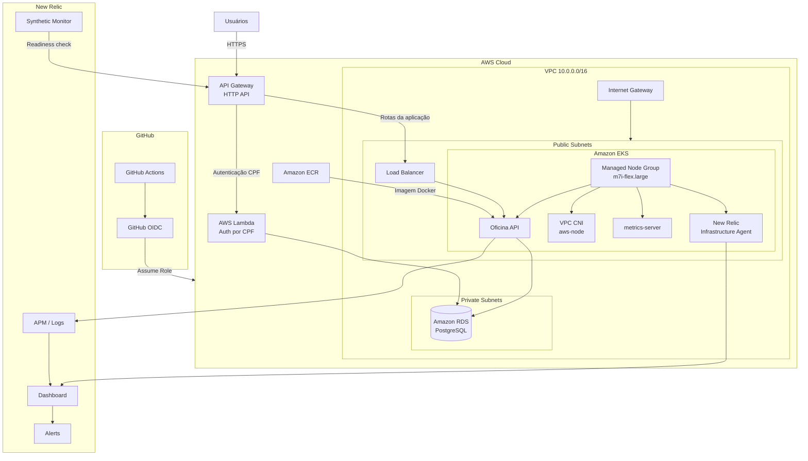

# Tech Challenge Oficina - Kubernetes Infra

Repositorio responsavel pela infraestrutura compartilhada da solucao **Tech Challenge Oficina**, provisionada na AWS com **Terraform**. Este projeto cria a base de rede, o cluster **AWS EKS**, o repositorio **ECR**, integracoes de acesso via **GitHub Actions OIDC**, API Gateway e observabilidade com **New Relic**.

## Responsabilidades

Este repositorio provisiona e mantem:

- VPC compartilhada da solucao.
- Subnets publicas e privadas em duas Availability Zones.
- Internet Gateway e tabela de rotas publica para acesso a internet.
- Cluster Amazon EKS.
- Managed node group do EKS.
- Repositorio ECR usado pela API.
- Add-ons gerenciados do EKS.
- API Gateway HTTP API para entrada publica da aplicacao.
- Integracao do API Gateway com a Lambda de autenticacao.
- Integracao do API Gateway com o backend da API publicado no EKS.
- Observabilidade Kubernetes e da aplicacao com New Relic.
- Roles IAM para deploy via GitHub Actions usando OIDC.

## Arquitetura

Fluxo conceitual da solucao:

```text
Internet
  -> API Gateway HTTP API
    -> POST /auth para Lambda Auth
    -> demais rotas para Load Balancer da API
      -> API executando no EKS
        -> RDS PostgreSQL em rede privada
```

O RDS PostgreSQL e provisionado no repositorio de banco de dados, mas consome a rede privada criada por este repositorio.

## Diagrama da arquitetura



## Rede

| Camada | Recurso | CIDR | Availability Zone | Finalidade |
| --- | --- | --- | --- | --- |
| VPC | `tech-challenge-oficina-vpc` | `10.0.0.0/16` | Regional | Rede compartilhada da solucao |
| Publica | `tech-challenge-oficina-public-us-east-1a` | `10.0.1.0/24` | `us-east-1a` | Recursos com rota para internet e suporte a Load Balancer publico |
| Publica | `tech-challenge-oficina-public-us-east-1b` | `10.0.2.0/24` | `us-east-1b` | Recursos com rota para internet e suporte a Load Balancer publico |
| Privada | `tech-challenge-oficina-private-us-east-1a` | `10.0.11.0/24` | `us-east-1a` | Camada privada para recursos internos, como banco de dados |
| Privada | `tech-challenge-oficina-private-us-east-1b` | `10.0.12.0/24` | `us-east-1b` | Camada privada para recursos internos, como banco de dados |

A VPC possui DNS habilitado, Internet Gateway e uma route table publica com rota `0.0.0.0/0` para o Internet Gateway associada apenas as subnets publicas.

Nao ha NAT Gateway definido no Terraform atual. Portanto, recursos em subnets privadas nao possuem saida direta para internet por NAT neste repositorio.

## EKS

| Item | Valor |
| --- | --- |
| Cluster | `tech-challenge-oficina` |
| Authentication mode | `API_AND_CONFIG_MAP` |
| Endpoint publico | Habilitado |
| Endpoint privado | Habilitado |
| Kubernetes version | Nao definida explicitamente no Terraform |
| Managed node group | `tech-challenge-oficina-nodes` |
| Instance type | `m7i-flex.large` |
| Capacity type | `ON_DEMAND` |
| Desired nodes | `1` |
| Min nodes | `1` |
| Max nodes | `2` |
| Subnets dos nodes | Publicas `us-east-1a` e `us-east-1b` |

O cluster e os nodes usam roles IAM dedicadas. Os nodes recebem permissoes gerenciadas da AWS para worker node, leitura do ECR e VPC CNI.

## EKS Add-ons

| Add-on | Finalidade |
| --- | --- |
| `metrics-server` | Coleta metricas basicas de CPU e memoria dos recursos Kubernetes, usadas por recursos como autoscaling e consultas operacionais do cluster. |
| `vpc-cni` | Integra a rede de pods do Kubernetes com a VPC da AWS, permitindo enderecamento e conectividade nativos na rede AWS. |

## ECR

O repositorio ECR `tech-challenge-oficina-api` armazena as imagens Docker da API `tech-challenge-oficina-api`.

Configuracoes atuais:

- `image_tag_mutability = MUTABLE`
- scan de imagem habilitado no push
- lifecycle policy mantendo as ultimas 10 imagens

## API Gateway

O API Gateway e opcional e controlado pela variavel `enable_api_gateway`.

Quando habilitado, o Terraform cria uma **HTTP API** chamada `tech-challenge-oficina-api` com:

- integracao `AWS_PROXY` para a Lambda de autenticacao;
- rota `POST /auth` direcionada para a Lambda `tech-challenge-oficina-auth`, ou outro nome informado em `auth_lambda_function_name`;
- integracao `HTTP_PROXY` para o backend da API no EKS;
- rota `$default` direcionada para `api_backend_url`;
- stage `$default` com `auto_deploy = true`;
- permissao para o API Gateway invocar a Lambda de autenticacao.

A URL publica do API Gateway e exposta no output `api_gateway_url` quando `enable_api_gateway = true`.

## New Relic

A observabilidade e opcional e controlada pela variavel `enable_new_relic`.

Quando habilitada, o Terraform instala o chart Helm `nri-bundle` no namespace `newrelic`, usando o secret Kubernetes `newrelic-license` criado pelo workflow com a license key de ingestao.

Configuracoes implementadas:

- `nri-bundle` via Helm.
- New Relic Infrastructure para Kubernetes.
- `kube-state-metrics` habilitado.
- `nri-metadata-injection` habilitado.
- `lowDataMode = true`.
- Dashboard `Tech Challenge Oficina Observability`.
- Politica de alertas `Tech Challenge Oficina Observability`.
- Synthetic monitor `tech-challenge-oficina-api-health` para `/actuator/health/readiness`, criado quando `new_relic_api_base_url` e informado.

## Dashboard

O dashboard `Tech Challenge Oficina Observability` possui a pagina `API and Kubernetes` com os seguintes indicadores:

- API latency: media e percentil 95 de duracao das transacoes.
- API HTTP errors: contagem de erros HTTP 5xx.
- Kubernetes CPU: percentual de CPU usado no cluster.
- Kubernetes memory: percentual de memoria usada no cluster.
- Pod health: status e restarts por namespace e pod.
- Daily service order volume: volume diario de ordens de servico.
- Average service order stage duration: duracao media por etapa da ordem de servico.
- External integration errors: erros por integracao externa e tipo de erro.

Alertas configurados:

- falha no health check sintetico da API;
- aumento de erros HTTP 5xx;
- alta latencia da API;
- pods Kubernetes indisponiveis ou com falha;
- alto uso de CPU no Kubernetes;
- alto uso de memoria no Kubernetes;
- erros em integracoes externas.

## Variaveis Terraform

| Nome | Descricao | Default | Sensivel |
| --- | --- | --- | --- |
| `aws_region` | Regiao AWS usada pelo provider AWS. | `us-east-1` | Nao |
| `api_backend_url` | URL publica base do Load Balancer da API no EKS. Obrigatoria quando `enable_api_gateway = true`. | `null` | Nao |
| `enable_api_gateway` | Define se os recursos do HTTP API Gateway serao criados. | `false` | Nao |
| `enable_new_relic` | Define se a integracao de observabilidade Kubernetes do New Relic sera instalada. | `false` | Nao |
| `new_relic_account_id` | ID da conta New Relic usada para dashboards, alertas e synthetics. Obrigatoria quando `enable_new_relic = true`. | `null` | Nao |
| `new_relic_api_key` | New Relic User API key usada pelo provider Terraform. | `""` | Sim |
| `new_relic_region` | Regiao da conta New Relic usada pelo provider. | `US` | Nao |
| `new_relic_api_base_url` | URL publica base da API usada pelo synthetic monitor em `/actuator/health/readiness`. Se `null`, o monitor nao e criado. | `null` | Nao |
| `auth_lambda_function_name` | Nome da Lambda de autenticacao usada pelo API Gateway. | `tech-challenge-oficina-auth` | Nao |

## Secrets

Valores sensiveis nao devem ser versionados no repositorio.

Secrets usados no workflow:

- `NEW_RELIC_API_KEY`: User API key do New Relic usada pelo provider Terraform para criar dashboard, alertas e synthetic monitor.
- `NEW_RELIC_LICENSE_KEY`: ingest license key do New Relic usada pelos agentes instalados no Kubernetes pelo `nri-bundle`.

A User API key e usada para chamadas administrativas na API do New Relic via Terraform. A license key e usada para ingestao de telemetria pelos agentes.

O workflow tambem depende de variaveis de ambiente do GitHub Actions:

- `AWS_DEPLOY_ROLE_ARN`
- `ENABLE_API_GATEWAY`
- `API_BACKEND_URL`
- `ENABLE_NEW_RELIC`
- `NEW_RELIC_ACCOUNT_ID`
- `NEW_RELIC_REGION`
- `NEW_RELIC_API_BASE_URL`

## Providers

Providers usados pelo Terraform principal:

- `hashicorp/aws` (`~> 5.0`)
- `hashicorp/helm` (`~> 2.0`)
- `newrelic/newrelic` (`~> 3.0`)

O provider Helm usa a configuracao Kubernetes do cluster EKS para instalar o `nri-bundle`. Nao ha provider `hashicorp/kubernetes` declarado no Terraform principal.

O diretorio `bootstrap/` usa `hashicorp/aws` e `hashicorp/random` apenas para criar o bucket S3 de remote state.

## Terraform Remote State

O Terraform principal usa backend remoto S3:

| Campo | Valor |
| --- | --- |
| Bucket | `tech-challenge-oficina-terraform-state-b1cfa326` |
| Key | `k8s-infra/terraform.tfstate` |
| Region | `us-east-1` |
| Encryption | `true` |
| Lock | `use_lockfile = true` |

O bucket de state e criado pelo Terraform em `bootstrap/`, com versionamento, criptografia SSE-S3 e bloqueio de acesso publico.

Em operacao normal, nao use `-lock=false`. O lock do state evita execucoes concorrentes e reduz risco de corrupcao do estado remoto.

## IAM e GitHub OIDC

O repositorio cria o OIDC provider `token.actions.githubusercontent.com` e roles IAM assumidas por GitHub Actions sem armazenar credenciais AWS estaticas.

Roles criadas:

- `tech-challenge-oficina-k8s-infra-deploy-role`: deploy deste repositorio.
- `tech-challenge-oficina-api-deploy-role`: push de imagem no ECR, leitura do EKS e leitura de RDS para a API.
- `tech-challenge-oficina-auth-deploy-role`: deploy da Lambda de autenticacao.
- `tech-challenge-oficina-database-infra-deploy-role`: deploy da infraestrutura de banco.

Access entries do EKS:

- `tech-challenge-oficina-api-deploy-role` com `AmazonEKSEditPolicy` no escopo do cluster.
- `tech-challenge-oficina-k8s-infra-deploy-role` com `AmazonEKSClusterAdminPolicy` no escopo do cluster.

## CI/CD

O workflow final esta em `.github/workflows/ci-cd.yml`.

Triggers:

- `pull_request` para `homolog` e `main`;
- `push` para `homolog` e `main`;
- `workflow_dispatch`.

Job `Terraform CI`:

- checkout do repositorio;
- setup do Terraform;
- `terraform fmt -check`;
- `terraform init -input=false -backend=false`;
- `terraform validate`.

Job `Terraform deploy`:

- executa apenas em `push` ou `workflow_dispatch` nas branches `homolog` e `main`;
- usa ambiente `homolog` para branch `homolog`;
- usa ambiente `production` para branch `main`;
- assume a role configurada em `AWS_DEPLOY_ROLE_ARN` via AWS OIDC;
- executa `terraform init`;
- executa `terraform plan` e `terraform apply`;
- quando New Relic esta habilitado, primeiro garante a infraestrutura base sem New Relic caso o cluster ainda nao exista;
- configura `kubectl` para o EKS;
- valida a presenca de `NEW_RELIC_API_KEY`;
- cria/atualiza o namespace `newrelic` e o secret `newrelic-license` com `NEW_RELIC_LICENSE_KEY`;
- aguarda os nodes ficarem `Ready`;
- valida o daemonset `aws-node`;
- executa `terraform plan` e `terraform apply` com as variaveis do New Relic.

## Estrategia de branches

- `homolog`: branch de homologacao.
- `main`: branch de producao.
- Alteracoes devem entrar por Pull Request.
- `homolog` e `main` devem ser tratadas como branches protegidas, com validacao do workflow antes de merge.

## Ordem de provisionamento da solucao

1. `oficina-k8s-infra` cria infraestrutura base de rede, EKS e ECR.
2. `tech-challenge-oficina-database-infra` cria o RDS PostgreSQL nas subnets privadas.
3. `tech-challenge-oficina-auth` provisiona a Lambda de autenticacao.
4. `tech-challenge-oficina-api` publica a API no EKS e cria o Load Balancer.
5. `oficina-k8s-infra` configura ou habilita o API Gateway com `api_backend_url` apontando para o backend disponivel.
6. `oficina-k8s-infra` habilita a observabilidade New Relic.

O workflow deste repositorio automatiza o deploy Terraform da infraestrutura. Mesmo assim, a habilitacao do API Gateway depende de a Lambda de autenticacao existir e de o backend da API ja possuir uma URL publica de Load Balancer.

## Ordem de destruicao

1. Remover ou desabilitar dependencias do API Gateway.
2. Remover a aplicacao e o Service Kubernetes responsavel pelo Load Balancer.
3. Destruir a infraestrutura de autenticacao.
4. Destruir a infraestrutura de banco de dados.
5. Destruir a infraestrutura Kubernetes deste repositorio.

A destruicao deve respeitar o lock do Terraform state e as dependencias entre repositorios.

## Relacao com outros repositorios

- `tech-challenge-oficina-api`: aplicacao backend executada no EKS e imagem publicada no ECR.
- `tech-challenge-oficina-auth`: Lambda serverless usada na rota de autenticacao do API Gateway.
- `tech-challenge-oficina-database-infra`: infraestrutura do RDS PostgreSQL em rede privada.

## Execucao local

No diretorio `terraform/`:

```bash
terraform init
terraform fmt -check
terraform validate
terraform plan
terraform apply
terraform destroy
```

Requisitos para execucao local:

- Terraform `>= 1.6.0`.
- Autenticacao AWS com permissoes equivalentes a manutencao dos recursos deste projeto.
- Acesso ao backend S3 de state remoto.
- New Relic User API key disponivel para `new_relic_api_key` quando `enable_new_relic = true`.
- New Relic ingest license key criada como secret Kubernetes `newrelic-license` quando os agentes forem instalados fora do workflow.
- `api_backend_url` definido quando `enable_api_gateway = true`.

## Seguranca

- Secrets e chaves ficam fora do codigo fonte.
- Deploys no GitHub Actions usam AWS OIDC, sem credenciais AWS estaticas.
- RDS PostgreSQL fica em subnets privadas, provisionado pelo repositorio de banco.
- Acesso entre camadas e controlado por security groups nos repositorios responsaveis.
- Terraform state fica em bucket S3 remoto com criptografia, versionamento e lockfile.
- Branches `homolog` e `main` devem ser protegidas e alteradas por Pull Request.
